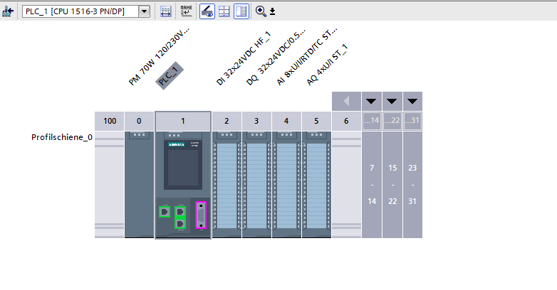
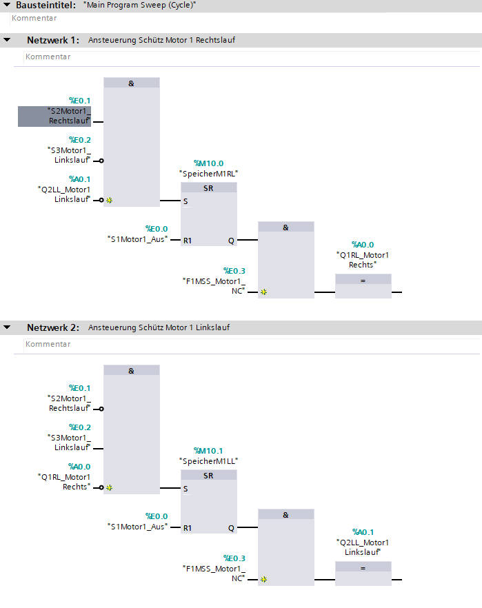
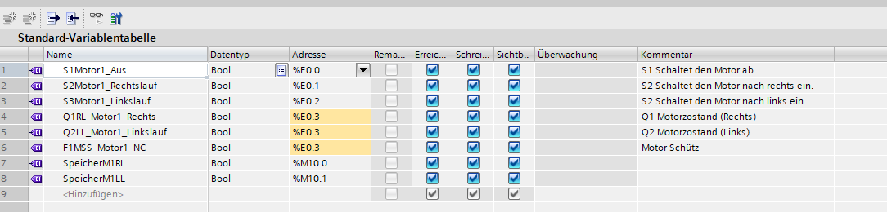

# SPS Wendeschütz Projekt – TIA Portal

Dieses Projekt zeigt die Steuerung eines Wendeschützes für einen Motor mit Rechtslauf und Linkslauf.

## Ziel des Projekts

Ziel ist es, einen Motor sicher in zwei Drehrichtungen zu steuern. Dabei werden Verriegelungen verwendet, damit Rechtslauf und Linkslauf nicht gleichzeitig aktiv sein können.

## Verwendete Software

- Siemens TIA Portal
- SPS / PLC Programmierung
- PLCSIM oder Simulation
- FUP / LAD Logik

## Funktionen

- Motor Rechtslauf
- Motor Linkslauf
- gegenseitige Verriegelung
- Start-/Stopp-Logik
- Dokumentation der Ein- und Ausgänge
- Testplan und Materialliste

## Projektstruktur

- `docs/` enthält Aufgabe, Arbeitsplan und Materialliste
- `tia-project/` enthält das TIA Portal Projektarchiv
- `images/` enthält Screenshots vom SPS-Programm
- `video/` enthält die Simulation

## Screenshots

### Gerätekonfiguration

### Hauptprogramm

### PLC Variablen

## Simulation

Die Simulation befindet sich im Ordner `video/`.

---
## Autor

### **Wessam Abo Zayed**

**Data Analyst | Machine Learning | SPS-/PLC-Programmierung**

---

**Data Analyst** mit Erfahrung in **Datenanalyse**, **Machine Learning** und **industrieller Automatisierung**.

Ich kombiniere analytische Fähigkeiten aus der Datenverarbeitung mit praktischen Kenntnissen in **SPS-/PLC-Programmierung**, insbesondere mit **Siemens TIA Portal**.

---

## Kontakt

| Kontakt      | Link                                                                            |
| ------------ | ------------------------------------------------------------------------------- |
| **E-Mail**   | [abozayed.wessam@gmail.com](mailto:abozayed.wessam@gmail.com)                   |
| **LinkedIn** | [linkedin.com/in/wessam-abozayed](https://www.linkedin.com/in/wessam-abozayed/) |
